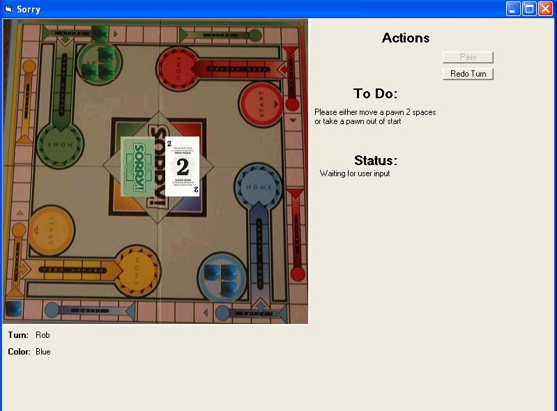



## VB Version of Board Game Sorry

### Description

This is the Visual Basic Version of Sorry. It has a test mode feature for debugging purposes. You can play up to 4 players. The next version may have computer play and network/internet play as well.
 
### More Info
 
Uses the text files provided for positioning information.

Uses many functions to calculate the moves.

There may be a few hidden bugs. If you can find a fix for them, then either email me or put a comment saying what function has the bug and what the fix should be.

             |
---                |---
**Submitted On**   |2002-06-15 01:38:44
**By**             |[A\. Walter](https://github.com/Planet-Source-Code/PSCIndex/blob/master/ByAuthor/a-walter.md)
**Level**          |Advanced
**User Rating**    |5.0 (10 globes from 2 users)
**Compatibility**  |VB 6\.0
**Category**       |[Games](https://github.com/Planet-Source-Code/PSCIndex/blob/master/ByCategory/games__1-38.md)
**World**          |[Visual Basic](https://github.com/Planet-Source-Code/PSCIndex/blob/master/ByWorld/visual-basic.md)
**Archive File**   |[VB\_Version947106152002\.zip](https://github.com/Planet-Source-Code/a-walter-vb-version-of-board-game-sorry__1-35873/archive/master.zip)

